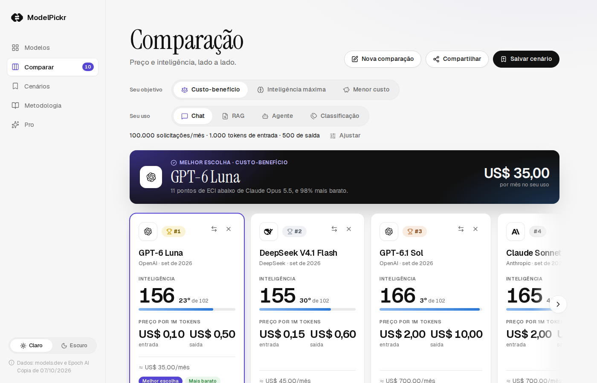

<div align="center">


# ModelPickr

[English](README.md) · **Português (Brasil)**

**Compare modelos. Escolha melhor.**

Comparador de modelos de linguagem com preços e inteligência reais: catálogo, comparação lado a lado, calculadora de custo e recomendação pelo seu objetivo.

[](https://github.com/LeoPeres/modelpickr/actions/workflows/ci.yml)


[](LICENSE)
[](https://epoch.ai/benchmarks)

</div>

<picture>
  <source media="(prefers-color-scheme: dark)" srcset="docs/screenshot-dark.png">
  
</picture>

## Sumário

- [Por que](#por-que)
- [Funcionalidades](#funcionalidades)
- [Como a recomendação funciona](#como-a-recomendação-funciona)
- [Dados e atribuição](#dados-e-atribuição)
- [Começando](#começando)
- [Testes](#testes)
- [Arquitetura](#arquitetura)
- [Contribuindo](#contribuindo)
- [Licença](#licença)

## Por que

Escolher um modelo de linguagem para produção costuma significar cruzar páginas de preço de cada empresa com rankings que usam escalas diferentes. O ModelPickr junta as duas coisas em um só lugar, com dados públicos e verificáveis, e responde uma pergunta concreta: **para o meu uso, qual modelo entrega mais pelo que custa?**

Nenhuma nota é inventada ou estimada. Dado ausente aparece como `—`, nunca como zero.

## Funcionalidades

- **Catálogo** (`/`): todos os modelos pagos com saída de texto e preço oficial da própria empresa, com busca tolerante a acentos e pontuação, filtro por empresa e ordenação.
- **Comparação** (`/compare`): até 10 modelos lado a lado, com estado inteiro na URL (`?models=anthropic/claude-opus-5-5,openai/gpt-6.1-sol`), pronta para compartilhar.
  - Objetivo: **custo-benefício**, **inteligência máxima** ou **menor custo**.
  - Perfis de uso (Chat, RAG, Agente, Classificação) ou volume e tokens ajustados à mão, incluindo a fração de entrada lida do cache.
  - Ranking dos cartões, com troféus para os três primeiros e destaque da melhor escolha.
  - Gráfico custo × inteligência em SVG, com eixo de custo logarítmico e a linha de valor igual passando pela recomendação.
  - Custo mensal por modelo, tabela de detalhes ("Só diferenças") e comparação por tarefa usando um benchmark da Epoch AI por vez.
- **Cenários** (`/scenarios`): salve, reabra, edite e exclua comparações.
- **Metodologia** (`/methodology`): fórmulas, fontes, limitações e atribuição.
- **Pro** (`/pro`): página de interesse em recursos futuros. Não há cobrança nem envio de dados.
- Tema claro e escuro, layout responsivo (barra de abas no celular), navegação por teclado no seletor de modelos (<kbd>Ctrl</kbd>/<kbd>⌘</kbd> + <kbd>K</kbd>) e respeito a `prefers-reduced-motion`.

Seleção, cenários e lista de interesse ficam **apenas no `localStorage` do navegador**. O app não tem banco de dados, contas nem rastreamento.

## Como a recomendação funciona

A inteligência de cada modelo é o [Epoch Capabilities Index (ECI)](https://epoch.ai/benchmarks). O custo mensal usa o preço de lista por milhão de tokens:

```
custo = solicitações × (tokens_entrada × taxa_entrada + tokens_saída × preço_saída) / 1.000.000
```

onde `taxa_entrada` mistura o preço de entrada com o de leitura de cache conforme a porcentagem de cache informada (sem preço de cache, vale o preço de entrada). Não entram escrita em cache, batch nem faixas de preço.

| Objetivo                 | Regra                                                                                                                  |
| ------------------------ | ---------------------------------------------------------------------------------------------------------------------- |
| Custo-benefício (padrão) | Maior `ECI − 3 × log2(custo mensal)`: dobrar o custo precisa render pelo menos 3 pontos de ECI. Não depende do volume. |
| Inteligência máxima      | Todo modelo cujo intervalo de confiança alcança o do melhor ECI conta como empate; vence o mais barato entre eles.     |
| Menor custo              | O modelo avaliado mais barato.                                                                                         |

Modelos sem ECI nunca vencem uma recomendação. Na comparação por tarefa, as notas de benchmarks diferentes nunca se misturam: cada tarefa usa um benchmark por vez, e vence o modelo mais barato que atinge a nota mínima (inclusiva). As regras são funções puras em [`lib/engine.ts`](lib/engine.ts), cobertas por [`tests/engine.test.ts`](tests/engine.test.ts).

## Dados e atribuição

| Fonte                                   | Uso                                                                       | Licença                                                                          |
| --------------------------------------- | ------------------------------------------------------------------------- | -------------------------------------------------------------------------------- |
| [models.dev](https://models.dev)        | Preços oficiais de API, contexto, capacidades, datas e logos das empresas | MIT                                                                              |
| [Epoch AI](https://epoch.ai/benchmarks) | ECI e benchmarks por tarefa                                               | CC BY 4.0 (atribuição obrigatória, exibida na barra lateral e em `/methodology`) |

Só entram preços da empresa dona do modelo; revendas (por exemplo, um provedor hospedando o modelo de outro) são descartadas. O servidor busca as fontes e guarda o catálogo montado por um dia. Se alguma fonte falhar ou o catálogo ao vivo encolher pela metade, o app usa a cópia em [`data/catalog.json`](data/catalog.json).

## Começando

Requisitos: Node.js 22 ou mais recente (o CI usa Node 24) e npm. Docker só é necessário para os testes de ponta a ponta. Não há variáveis de ambiente obrigatórias.

```sh
git clone https://github.com/LeoPeres/modelpickr.git
cd modelpickr
npm ci
npm run dev   # http://localhost:3000
```

| Script               | O que faz                                                               |
| -------------------- | ----------------------------------------------------------------------- |
| `npm run dev`        | Servidor de desenvolvimento (Turbopack) em `0.0.0.0:3000`               |
| `npm run build`      | Build de produção (usa Webpack de propósito)                            |
| `npm start`          | Serve o build de produção                                               |
| `npm run typecheck`  | `tsc --noEmit`                                                          |
| `npm test`           | Testes unitários (`node:test` via `tsx`)                                |
| `npm run sync`       | Atualiza `data/catalog.json` e `public/logos/*.svg` a partir das fontes |
| `npm run e2e`        | Testes de ponta a ponta e visuais com Playwright, em Docker             |
| `npm run e2e:update` | Igual, regravando as capturas de referência                             |

## Testes

**Unitários.** `npm test` roda [`tests/engine.test.ts`](tests/engine.test.ts) com fixtures próprias, sem depender dos dados ao vivo. Para um teste só:

```sh
npx tsx --test --test-name-pattern="seleção por URL" tests/engine.test.ts
```

**Ponta a ponta e visuais.** `npm run e2e` copia o projeto para a imagem oficial do Playwright, gera um build de produção e roda os fluxos principais ([`flows.spec.ts`](tests/e2e/flows.spec.ts)) e as comparações de captura de tela ([`visual.spec.ts`](tests/e2e/visual.spec.ts)) em desktop (1400×900) e celular (Pixel 7), nos temas claro e escuro. O catálogo fica congelado em [`tests/e2e/catalog.json`](tests/e2e/catalog.json), então mudanças nos dados não quebram as capturas.

```sh
npm run e2e -- --project desktop --grep "gráfico"   # um subconjunto
npx playwright show-report                          # relatório da última execução
```

Quando um teste visual falha, `test-results/` traz as imagens esperada, atual e a diferença. Gere as referências sempre pelo Docker: a renderização de fontes muda fora dele.

**CI.** O [workflow](.github/workflows/ci.yml) roda typecheck, testes unitários, build e a suíte de ponta a ponta em cada push para `main` e em cada pull request.

## Arquitetura

Next.js 16 (App Router, Cache Components), React 19, TypeScript, Tailwind CSS v4 e [lucide-react](https://lucide.dev). Sem biblioteca de gráficos nem de estado.

```
app/                  Rotas (wrappers finos); /scenarios e /methodology com conteúdo inline
components/
  shell.tsx           Layout cliente; useCatalog() e useSelection()
  catalog.tsx         Catálogo (/)
  comparison.tsx      Comparação (/compare), estado na URL
  cost-chart.tsx      Gráfico custo × inteligência em SVG
  model-picker.tsx    Seletor estilo command palette
  carousel.tsx        Carrossel com snap, arraste e animações FLIP
lib/
  catalog/build.ts    Monta o catálogo a partir das três fontes brutas (função pura)
  catalog/server.ts   getCatalog(): fontes ao vivo, cache de um dia, fallback local
  catalog/tasks.ts    Tarefas → benchmark da Epoch AI
  engine.ts           Custo, rankings, empates e recomendações (função pura)
  storage.ts          Chaves e validadores do localStorage
  i18n.ts             Formatadores Intl em pt-BR
data/catalog.json     Cópia de segurança do catálogo
scripts/              Sincronização de dados e execução do e2e em Docker
tests/                Testes unitários e e2e
```

A interface é em português do Brasil (`lang="pt-BR"`), e números, moeda e datas passam por `Intl` em [`lib/i18n.ts`](lib/i18n.ts) (por exemplo, `US$ 1.400,00`).

## Contribuindo

Issues e pull requests são bem-vindos. Antes de abrir um PR:

1. Rode `npm run typecheck` e `npm test`.
2. Se a mudança altera a interface de propósito, rode `npm run e2e:update` e inclua as capturas novas no PR.
3. Siga as regras do domínio: nunca invente ou estime uma nota (dado ausente é `null` e aparece como `—`), nunca formate números com `toFixed` ou `$` solto, e escreva textos da interface e nomes de teste em pt-BR.
4. Cores novas precisam de variável para os dois temas e contraste de pelo menos 4,5:1.
5. Mensagens de commit em inglês.

Formatação com Prettier: `npx prettier --write <arquivos>`.

## Licença

O código é distribuído sob a [licença MIT](LICENSE). Os dados seguem as licenças das fontes: models.dev sob MIT e Epoch AI sob [CC BY 4.0](https://creativecommons.org/licenses/by/4.0/), que exige atribuição em qualquer redistribuição.

Dados de preço e especificações: [models.dev](https://models.dev). Inteligência e benchmarks: [Epoch AI](https://epoch.ai/benchmarks).
